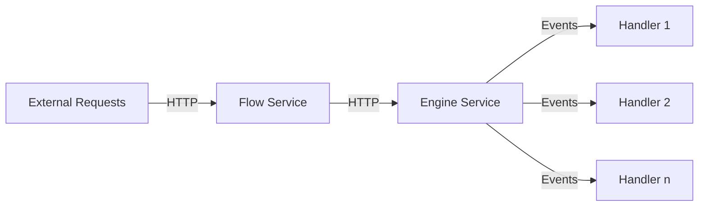

# Boomerang Flow Services Monorepo

Welcome to the Boomerang Flow Services Monorepo! This repository is the powerhouse behind the Boomerang Flow Workflow
services that enable the creation and execution of workflows as Directed Acyclic Graphs (DAGs).

The [Flow service](./service-flow) provides v2 RESTful APIs for the CRUD operations backing the front-end and direct
consumption with:
comprehensive User & Team Management, relationship graph
between objects, authentication and authorisation, scheduling engine and so on.

The [Engine service](./service-engine) is the backbone providing the execution of the workflows as Directed Acyclic
Graphs (DAGs).

The [Handler service](./service-handler) is the service that listens to events and executes the appropriate tasks. The
Handler that comes with Boomerang Flow by default is the Tekon Handler and executes the Tasks using Tekton on
Kubernetes. Additional implementations can be added, such as running tasks on IBM Code Engine or Azure Container Apps,
etc

## Dependencies

With dependencies like CloudEvents and Quartz, this service ensures
reliable event consumption and scheduled job execution.

### Prerequisites

1. Java 21
2. Spring Boot 3
3. Maven

### CloudEvents

This service listen and consumes CloudEvents.

### Quartz

The Java Quartz library is used for running scheduled jobs via mongoDB and underpins the Schedule trigger.

The following links will help provide guidance in development

- http://www.quartz-scheduler.org/documentation/quartz-2.2.2/tutorials/tutorial-lesson-04.html
- http://www.quartz-scheduler.org/documentation/2.4.0-SNAPSHOT/cookbook/UpdateTrigger.html
- https://github.com/StackAbuse/spring-boot-quartz/blob/master/src/main/java/com/stackabuse/service/SchedulerJobService.java
- https://stackabuse.com/guide-to-quartz-with-spring-boot-job-scheduling-and-automation/

## Packaging

When ready to package the service(s) as a container, the tags will trigger the appropriate GitHub Action using the
format `<svc>/<semver>`:

- Engine Service: tag = `engine/1.0.0-beta.111`
- Flow Service: tag = `flow/4.0.1`

## Developing and Testing Locally

1. Clone the repository
2. Run `mvn clean install` to build the project
3. Run `mvn spring-boot:run` to start the application

## Security

Security is enabled / disabled through the `flow.authorization.enabled` flag in the application.properties

The following classes are conditionally loaded based on this flag

| Class | Condition |
| AuthenticationFilter | true |
| InterceptorConfig (and by association SecurityInterceptor) | true |
| SecurityConfiguration | true |
| SecurityDisabledConfiguration | false |

