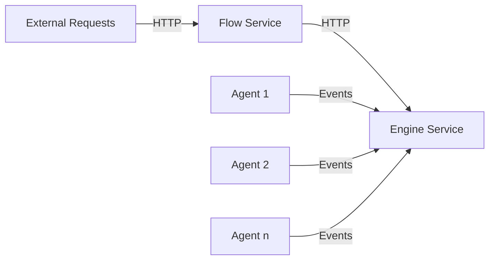

# Boomerang Flow Services Monorepo

Welcome to the Boomerang Flow Services Monorepo! This repository is the powerhouse behind the Boomerang Flow Workflow
services that enable the creation and execution of workflows as Directed Acyclic Graphs (DAGs).

The [Flow service](./service-flow) provides v2 RESTful APIs for the CRUD operations backing the front-end and direct
consumption with:
comprehensive User & Team Management, relationship graph
between objects, authentication and authorisation, scheduling engine and so on.

The [Engine service](./service-engine) is the backbone providing the execution of the workflows as Directed Acyclic
Graphs (DAGs).

The [Agent service](./service-agent) is the service that connects to the Engine and retrieves and executes the
appropriate filtered Workflows and Tasks. The Agent that comes by default is the Tekton Agent and
executes the Tasks using Tekton on Kubernetes. Additional implementations can be added, such as IBM
Code Engine, Azure Container Apps, etc



## v3 to v4 Change Log

There has been an entire code base refactor from v3 to v4 for the engine. We suggest you read the following information
to understand the full breadth of changes

- [Model changes and v3 to v4 model comparison](https://github.com/boomerang-io/roadmap/issues/368)
- [Distributed async architecture change](https://github.com/boomerang-io/architecture/tree/feat-v4)

## Dependencies

With dependencies like CloudEvents and Quartz, this service ensures
reliable event consumption and scheduled job execution.

### Prerequisites

1. Java 21
2. Spring Boot 3
3. Maven

### CloudEvents

This service listen and consumes CloudEvents.

### Quartz

The Java Quartz library is used for running scheduled jobs via mongoDB and underpins the Schedule trigger.

The following links will help provide guidance in development

- http://www.quartz-scheduler.org/documentation/quartz-2.2.2/tutorials/tutorial-lesson-04.html
- http://www.quartz-scheduler.org/documentation/2.4.0-SNAPSHOT/cookbook/UpdateTrigger.html
- https://github.com/StackAbuse/spring-boot-quartz/blob/master/src/main/java/com/stackabuse/service/SchedulerJobService.java
- https://stackabuse.com/guide-to-quartz-with-spring-boot-job-scheduling-and-automation/

## Packaging

When ready to package the service(s) as a container, the tags will trigger the appropriate GitHub Action using the
format `<svc>/<semver>`:

- Engine Service: tag = `engine/1.0.0-beta.111`
- Flow Service: tag = `flow/4.0.1`

## Developing and Testing Locally

### Pre-requisits

This service connects to MongoDB and requires Task Templates and indexes loaded through the Flow Loader. You can run
these locally, or alternatively connect to a remote MongoDB service.

### Run Local MongoDB w Docker

```
docker run --name local-mongo -d mongo:latest
```

### Load Boomerang Flow Data

```
docker run -e JAVA_OPTS="-Dspring.data.mongodb.uri=mongodb://localhost:27017/boomerang -Dflow.mongo.collection.prefix=flow -Dspring.profiles.active=flow" --network host --platform linux/amd64 boomerangio/flow-loader:latest
```

### Development via Spring

1. Clone the repository
2. Run `mvn clean install` to build the project
3. Run `mvn spring-boot:run` to start the application

### Development via Docker

```
docker buildx build --platform=linux/amd64 -f ./service-engine/Dockerfile -t flow-engine:latest .
docker run -e JAVA_OPTS="-Dspring.data.mongodb.uri=mongodb://localhost:27017/boomerang -Dflow.mongo.collection.prefix=flow -Dspring.profiles.active=flow" --platform=linux/amd64 flow-engine:latest
```

## Design Details

### Parameters and Results

The implementation is based on Tekton Params and Results.

There is limited support
for [Tekton Propagated Object Parameters](https://tekton.dev/docs/pipelines/taskruns/#propagated-object-parameters) in
that Tekton requires you to provide the Spec for the JSON Object if you are going to reference child elements. We do not
have this constraint, we essentially take the path from what is provided after `params.<param-name>`.

### Locks

For distributed locking, we use this [distributed lock](https://github.com/alturkovic/distributed-lock) project with the
Mongo implementation.

The implementation in `LockManagerImpl.java` relies on the TTL Index for Retries having been added via
the `flow.loader`.

## Error Handling

The following provides design and reference information about the status codes and error messages.

### Response Format

The format can be seen in `io.boomerang.error.ErrorDetail.java`

| Field     | Description                                                                                                          |
|-----------|----------------------------------------------------------------------------------------------------------------------|
| timestamp | UTC timestamp of when the error occurred                                                                             | 
| code      | unique identifier (int) that can be read and understood that detect and handle errors programmatically.              |
| reason    | unique identifier (string) that can be used to quickly identify and search for more information regarding the error. |
| message   | a description of the error intended for a human and an end user to provide context.                                  |
| status    | HTTP Status Code & Message                                                                                           |
| cause     | Optional present if `flow.error.include-cause=true` config property is provided                                      |

```json
{
  "timestamp": "2023-01-31T00:15:12.672+00:00",
  "code": 1001
  "reason": "QUERY_INVALID_FILTERS",
  "message": "Invalid query filters(status) have been provided.",
  "status": "400 BAD_REQUEST",
  "cause": null
}
```

### Implementation

The implementation allows for known and custom exceptions in the code.

Known codes are indexed in the `io.boomerang.error.BoomerangError.java` with the message text in `messages.properties`.
Alternatively, a custom exception can be thrown in the code however this will lose the benefit of localization (
_future_)

## Feature Flags

### Security

Security is enabled / disabled through the `flow.authorization.enabled` flag in the application.properties

The following classes are conditionally loaded based on this flag

| Class                                                      | Condition |
|------------------------------------------------------------|-----------|
| AuthenticationFilter                                       | true      |
| InterceptorConfig (and by association SecurityInterceptor) | true      |
| SecurityConfiguration                                      | true      |
| SecurityDisabledConfiguration                              | false     |

